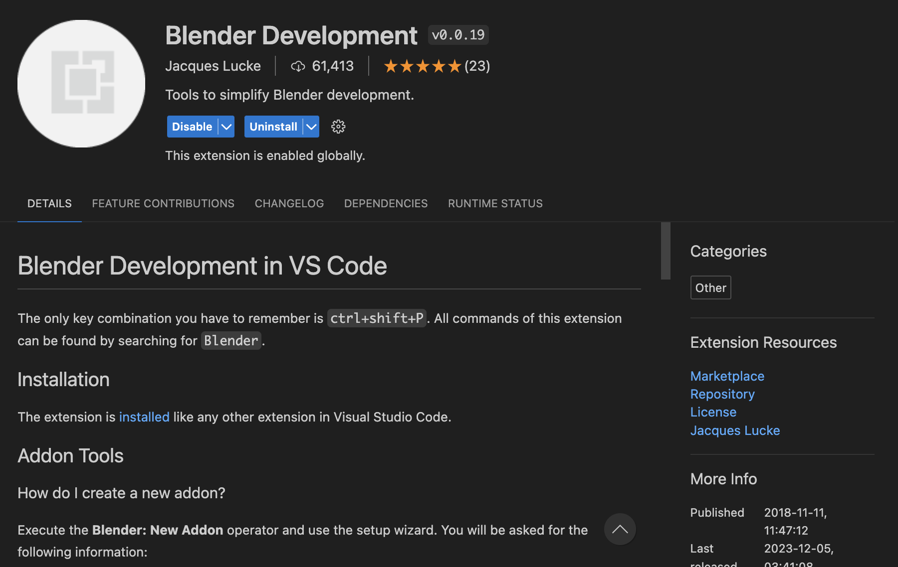

# Abstract Art Generator

The Abstract Art Generator does exactly what it sounds like - it's designed to generate random abstract images through a Blender script. Assets in the /assets/ folder are imported into Blender, given random values for position, rotation and meterial, and then are rendered at a random camera position and focal length.

## Setting up the environment

### Install Blender:

Download and install Blender from the official Blender website: [Blender Download](https://www.blender.org/download/)

### Open Visual Studio Code:

If you don't have Visual Studio Code installed, download and install it from the official website: [Visual Studio Code Download](https://code.visualstudio.com/)

Install the "Blender Development" extension for Visual Studio Code. Open the Extensions view (Ctrl+Shift+X) and search for "Blender Development." Install the extension.



### Locate Blender Python Interpreter:

Find the path to Blender's Python interpreter, typically located within the Blender application package (e.g., /Applications/Blender.app/Contents/Resources/3.10/python/bin/python3.10).

### Configure Python Interpreter in VSCode:

Open Visual Studio Code, go to the command palette (Ctrl+Shift+P), and run the command "Python: Select Interpreter." Choose the Blender Python interpreter path.

### Restart VSCode:

Restart Visual Studio Code to apply the changes.

### Add Blender to your PATH environment (optional):

#### Windows:

1. Find the path to your Blender installation (e.g., `C:\Program Files\Blender Foundation\Blender`).

2. Copy the path to the Blender directory.

3. Right-click on "This PC" or "Computer" on your desktop or in File Explorer and select "Properties."

4. Click on "Advanced system settings" on the left.

5. Click the "Environment Variables" button.

6. In the "System variables" section, scroll down and find the "Path" variable. Select it and click "Edit."

7. Click "New" and paste the path to the Blender directory.

8. Click "OK" to close each window.

9. Open a new command prompt and type `blender` to verify that Blender launches.

#### macOS and Linux:

1. Open a terminal.

2. Find the path to your Blender installation (e.g., `/Applications/Blender.app/Contents/MacOS` on macOS or `/opt/blender/blender [version]/` on Linux).

3. Open your shell profile file (`~/.bashrc`, `~/.bash_profile`, `~/.zshrc`, etc.) using a text editor like `nano`, `vim`, or `gedit`.

   ```bash
   nano ~/.bashrc
   ```

4. Add the following line to the end of the file, replacing `/path/to/blender` with the actual path to your Blender installation:

   ```bash
   export PATH=$PATH:/path/to/blender
   ```

5. Save the file and exit the text editor.

6. In the terminal, type `source ~/.bashrc` (or the corresponding command for your shell) to apply the changes to the current session.

7. Open a new terminal and type `blender` to verify that Blender launches.

Keep in mind that the exact steps may vary depending on your system configuration and the specific shell you're using.